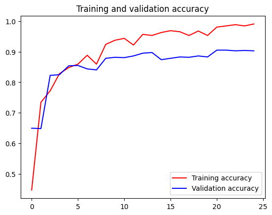
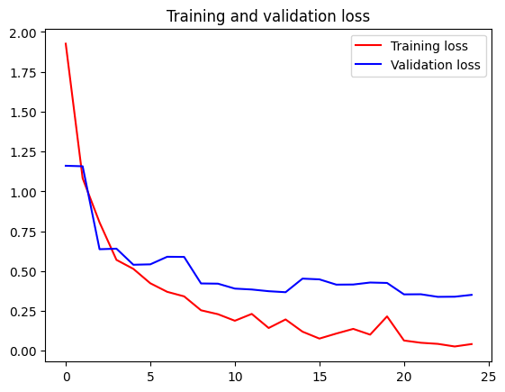
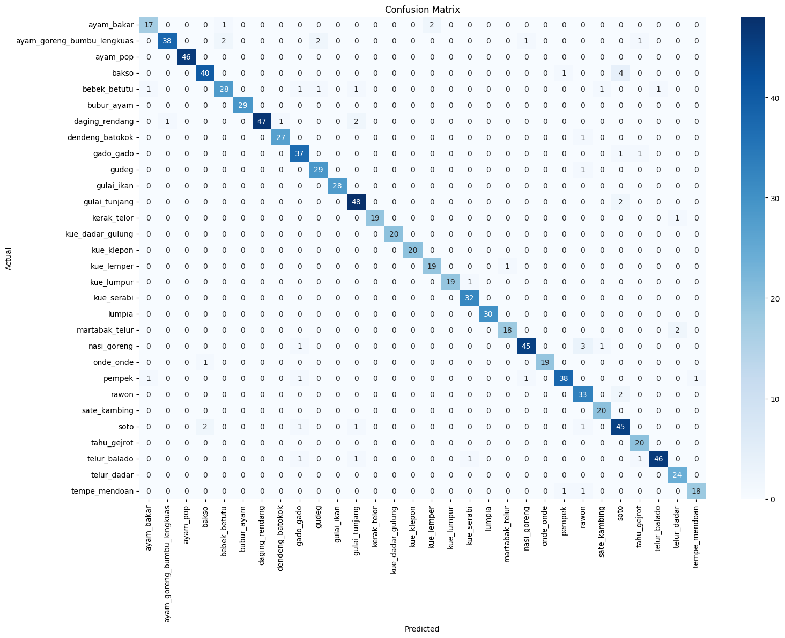

# Klasifikasi Gambar Makanan Tradisional Indonesia - Proyek Capstone Tim Foodinary (Machine Learning)

Selamat datang di repository Machine Learning dari Tim Foodinary! Dalam Proyek Capstone ini, tim Machine Learning kami berfokus pada pengembangan model _deep learning_ yang canggih untuk mengklasifikasikan gambar berbagai makanan tradisional khas Indonesia.

## 📜 Deskripsi Proyek

Indonesia dianugerahi kekayaan kuliner yang sangat beragam dan mengagumkan. Namun, kami menyadari adanya tantangan dalam mengenali atau mengetahui nama makanan tertentu, baik bagi wisatawan maupun masyarakat lokal dari daerah lain. Oleh karena itu, kami mengembangkan model klasifikasi gambar ini sebagai salah satu komponen inti dari solusi "Foodinary", yang bertujuan untuk membantu pengguna mengidentifikasi makanan tradisional Indonesia secara mudah melalui gambar.

## Dataset

Dataset yang kami gunakan dalam proyek ini adalah kumpulan gambar makanan tradisional Indonesia. Kami telah mengumpulkan dan melabeli gambar-gambar ini secara saksama untuk memastikan kualitas data yang baik untuk pelatihan model.

- **Link Dataset:** Dataset lengkap dapat diunduh melalui link Google Drive berikut:
  [Unduh Dataset Makanan Tradisional Indonesia - Foodinary](https://drive.google.com/drive/folders/1qkYX9xYrxV8H0_moeGQi-MPkmawsHbES)
- **Jumlah Kelas:** Kami telah mengidentifikasi dan mengumpulkan data untuk **30 kelas** makanan yang berbeda.
- **Daftar Kelas Makanan:**
  - `ayam_bakar`
  - `ayam_goreng_bumbu_lengkuas`
  - `ayam_pop`
  - `bakso`
  - `bebek_betutu`
  - `bubur_ayam`
  - `daging_rendang`
  - `dendeng_batokok`
  - `gado_gado`
  - `gudeg`
  - `gulai_ikan`
  - `gulai_tunjang`
  - `kerak_telor`
  - `kue_dadar_gulung`
  - `kue_klepon`
  - `kue_lemper`
  - `kue_lumpur`
  - `kue_serabi`
  - `lumpia`
  - `martabak_telur`
  - `nasi_goreng`
  - `onde_onde`
  - `pempek`
  - `rawon`
  - `sate`
  - `soto`
  - `tahu_gejrot`
  - `telur_balado`
  - `telur_dadar`
  - `tempe_mendoan`

Setelah mengunduh, dataset perlu diekstrak dan seluruh folder kelas makanan ditempatkan ke dalam direktori `unprocessed_dataset/` di root proyek ini. Struktur yang diharapkan adalah sebagai berikut:

```
machine-learning/
├── unprocessed_dataset/
│   ├── ayam_bakar/
│   │   ├── gambar1.jpg
│   │   └── ...
│   ├── ayam_goreng_bumbu_lengkuas/
│   └── ...
├── assets/
├── model_food_classification.h5
├── model_capstone.ipynb
├── README.md
└── ...
```

## 🤖 Arsitektur Model

Untuk tugas klasifikasi gambar makanan ini, kami memilih untuk mengembangkan model menggunakan arsitektur **DenseNet-201**. Kami memanfaatkan teknik _transfer learning_ dengan menggunakan bobot awal yang telah dilatih pada dataset ImageNet. Pendekatan ini kami pilih untuk mempercepat proses konvergensi model dan meningkatkan performa generalisasinya. Implementasi model ini kami lakukan menggunakan _framework_ TensorFlow dan Keras.

## ⚙️ Struktur Proyek Kami

Berikut adalah gambaran umum struktur file dan folder utama yang kami gunakan dalam repository Machine Learning ini:

- `assets/`: Direktori ini kami gunakan untuk menyimpan aset gambar pendukung file `README.md`, seperti grafik _accuracy_ (`acc.png`), _loss_ (`loss2.png`) dan _confusion matrix_ (`cm.png`).
- `model_food_classification.h5`: File model HDF5 versi perbaikan.
- `unprocessed_dataset/`: Direktori ini adalah tempat untuk meletakkan dataset gambar mentah setelah diunduh (direktori ini kami konfigurasikan untuk diabaikan oleh Git melalui `.gitignore`).
- `.gitignore`: File konfigurasi Git yang kami gunakan untuk menentukan file dan folder mana saja yang harus diabaikan dan tidak perlu dilacak (misalnya `unprocessed_dataset/`, `venv/`, `__pycache__/`).
- `model_capstone.ipynb`: Notebook Jupyter utama kami. File ini mencakup seluruh alur kerja proyek Machine Learning kami, mulai dari pemuatan dan pemrosesan data, augmentasi gambar, perancangan arsitektur model (DenseNet-201), proses pelatihan, hingga evaluasi performa model secara komprehensif.
- `README.md`: File dokumentasi utama ini, yang menjelaskan proyek Machine Learning kami.
- `requirements.txt`: File ini kami sediakan untuk mencatat semua pustaka Python beserta versinya yang dibutuhkan agar proyek kami dapat berjalan dengan baik di lingkungan lain.

## 🚀 Instalasi dan Persiapan Lingkungan

Untuk menjalankan kode dan melatih model dalam proyek kami, berikut langkah-langkah persiapan yang perlu diikuti:

1.  **Clone Repository:**
    Lakukan clone repository ini ke mesin lokal:

    ```bash
    git clone https://github.com/foodinary-project/machine-learning.git
    cd machine-learning
    ```

2.  **Install Dependensi:**
    Kami telah menyediakan file `requirements.txt` yang berisi semua pustaka yang dibutuhkan. Instal menggunakan perintah:

    ```bash
    pip install -r requirements.txt
    ```

3.  **Unduh Dataset:**
    Pastikan untuk mengunduh dataset dari [link ini](https://drive.google.com/drive/folders/1qkYX9xYrxV8H0_moeGQi-MPkmawsHbES) dan meletakkannya ke dalam folder `unprocessed_dataset/` seperti yang telah kami jelaskan di bagian Dataset.

## notebooks Menjalankan Model dan Kode Kami

1.  **Buka Jupyter Notebook/Lab:**
    Setelah semua dependensi terinstal dan dataset siap, jalankan Jupyter Notebook atau Jupyter Lab dari terminal:

    ```bash
    jupyter lab
    # atau
    jupyter notebook
    ```

2.  **Jalankan Notebook Utama (`model_capstone.ipynb`):**
    Buka file `model_capstone.ipynb`. Sel-sel di dalam notebook ini dapat dijalankan secara berurutan untuk melihat seluruh proses kerja kami, mulai dari _preprocessing_ data, pelatihan model, hingga tahap evaluasi.

3.  **Mencoba Prediksi:**
    Di dalam notebook `model_capstone.ipynb`, kami juga mungkin telah menyertakan fungsi atau sel kode untuk melakukan prediksi pada gambar baru. Silakan ikuti instruksi yang ada di dalam notebook tersebut untuk mencoba melakukan prediksi.

## 📊 Hasil Evaluasi Model Kami

Berikut adalah beberapa hasil evaluasi yang kami peroleh dari model DenseNet-201 yang telah kami latih:

### Grafik Akurasi dan Loss Pelatihan

Grafik di bawah ini menunjukkan bagaimana metrik akurasi dan _Accuracy_ model kami berubah selama proses pelatihan, baik pada data _training_ maupun data validasi.


Grafik di bawah ini menunjukkan bagaimana metrik akurasi dan _loss_ model kami berubah selama proses pelatihan, baik pada data _training_ maupun data validasi.


### Confusion Matrix

_Confusion matrix_ di bawah ini menggambarkan secara detail performa klasifikasi model kami pada set data validasi untuk setiap kelas makanan.


Dari _confusion matrix_ ini, dapat kami amati seberapa baik model kami dalam membedakan antar kelas, serta mengidentifikasi kelas-kelas makanan mana saja yang mungkin masih sering tertukar oleh model.

---

Kami berharap README ini memberikan gambaran yang jelas mengenai proyek Machine Learning yang kami kerjakan untuk Foodinary. Untuk pertanyaan, diskusi, atau masukan lebih lanjut, silakan buat _issue_ di repository ini atau hubungi tim kami. Terima kasih!
